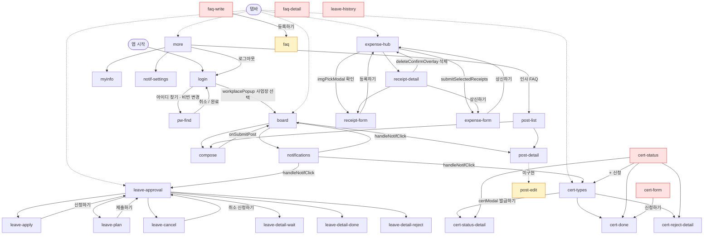
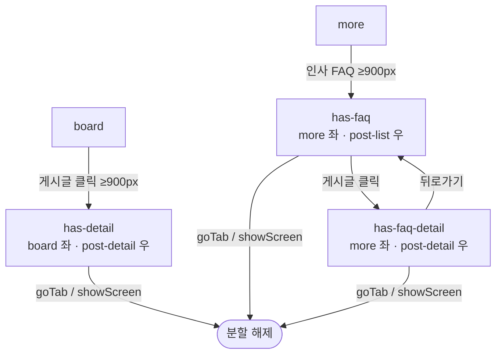

# MY인사 모바일 — 화면 플로우맵

`data-screen` 기준 33개 화면 + 미구현 참조 화면 1개(`post-edit`)의 진입·이탈·오버레이를 정리한다.  
화면 전환 메커니즘: `showScreen()` / `goBack()` (히스토리 스택) / `goTab()` (탭바).

> 신규 화면의 진입·이탈 등록 절차는 `checklist_new_screen_mobile.md` 2~3단계를 따른다.

> **태블릿(≥900px) 분할 플로우는 맨 아래 별도 섹션** 참고.

---

## 탭바 루트 (5개)

`goTab(name)` 호출 시 아래 화면으로 직접 이동한다. 탭바는 로그인·pw-find 화면을 제외한 모든 화면에서 노출된다.

| 탭 순서 | 탭 name | data-screen | 설명 |
|--------|---------|------------|------|
| 1 | `board` | `board` | 게시판 — 로그인 직후 최초 진입 화면 |
| 2 | `leave` | `leave-approval` | 연차 관리 허브 |
| 3 | `expense` | `expense-hub` | 영수증 관리 허브 |
| 4 | `cert` | `cert-types` | 증명서 관리 허브 |
| 5 | `more` | `more` | 더보기 허브 |

---

## 화면별 플로우

### 공통 — 로그인

#### `login`
- **진입**: 앱 최초 실행 / `more` 로그아웃 / `pw-find` 취소·완료
- **이탈**: `workplacePopup`(사업장 선택) → `selectWorkplace()` → `board` / 아이디 찾기·비번 변경 → `pw-find`
- **오버레이**: `workplacePopup` (사업장 선택 목록)

#### `pw-find`
- **진입**: `login` → `goPwFind('id'|'pw')`
- **이탈**: 취소 버튼 → `login` / 처리 완료 1.5 s 후 → `login` / `pfResultOverlay` 로그인 버튼 → `login`
- **오버레이**: `pfResultOverlay` (아이디 찾기 결과 팝업)

---

### 게시판

#### `board` ★탭 루트
- **진입**: `goTab('board')` / `compose` 등록하기(`onSubmitPost()`) / `selectWorkplace()` 로그인 완료 / `notifications` 알림 클릭
- **이탈**: 알림 버튼 → `notifications` / 글쓰기 FAB → `compose` / 게시글 클릭(`openPost()`) → `post-detail`
- **오버레이**: `boardFilterSheet` (게시판 필터 시트)

#### `post-list`
- **진입**: `more` 인사 FAQ → `goPostList('인사 FAQ', true)`
- **이탈**: `goBack()` → `more` / 게시글 클릭 → `post-detail` / 글쓰기 FAB → `compose` *(FAQ 게시판에서는 FAB 숨김)*
- **오버레이**: 없음

#### `post-detail`
- **진입**: `board`·`post-list` → `openPost()` / `post-detail` 상단 공지 클릭 (히스토리 직접 push)
- **이탈**: `goBack()` / 더보기 버튼 → `postActionSheet` → 수정 → `post-edit`*(미구현)* / 삭제 → `postDeleteConfirmOverlay` → 확인 → `goBack()`
- **오버레이**: `postActionSheet` (수정·삭제 액션시트), `postDeleteConfirmOverlay` (삭제 확인 다이얼로그)

#### `compose`
- **진입**: `board`·`post-list` → 글쓰기 FAB → `showScreen('compose')`
- **이탈**: 취소 버튼 → `goBack()` / 등록 버튼(`onSubmitPost()`) → `board`
- **오버레이**: 없음

---

### 더보기

#### `more` ★탭 루트
- **진입**: `goTab('more')`
- **이탈**: 내 정보 → `myinfo` / 알림 설정 → `notif-settings` / 인사 FAQ → `post-list` / 사업장 전환하기 → `switchWorkplacePopup` / 로그아웃 → `login`
- **오버레이**: `switchWorkplacePopup` (사업장 전환 팝업)

#### `myinfo`
- **진입**: `more` → `showScreen('myinfo')`
- **이탈**: `goBack()`
- **오버레이**: 없음

#### `notif-settings`
- **진입**: `more` → `showScreen('notif-settings')`
- **이탈**: `goBack()`
- **오버레이**: 없음

#### `notifications`
- **진입**: `board` → 알림 아이콘 버튼 → `showScreen('notifications')`
- **이탈**: `goBack()` / 알림 항목 클릭(`handleNotifClick(screen)`) → `board` · `leave-approval` · `cert-types`
- **오버레이**: 없음

#### `faq` ⚠ 사실상 고립
- **진입**: `faq-write` 등록하기 → `showScreen('faq')` *— faq-write 자체가 고립이므로 사실상 진입 불가*
- **이탈**: `goBack()`
- **오버레이**: 없음

#### `faq-write` ⚠ 고립
- **진입**: 없음 (`showScreen('faq-write')` 호출 없음)
- **이탈**: `goBack()` / 등록하기 → `faq`
- **오버레이**: 없음

#### `faq-detail` ⚠ 고립
- **진입**: 없음 (`showScreen('faq-detail')` 호출 없음)
- **이탈**: `goBack()`
- **오버레이**: 없음

---

### 연차

#### `leave-approval` ★탭 루트
- **진입**: `goTab('leave')` / `leave-apply` 신청하기 / `leave-plan` 제출하기 / `leave-cancel` 취소 신청하기 / `notifications` 알림 클릭
- **이탈**: 이력 항목 클릭(`showLeaveDetail()`) → `leave-detail-wait` · `leave-detail-done` · `leave-detail-reject` / FAB → `leave-apply` · `leave-plan` · `leave-cancel`
- **오버레이**: 없음

#### `leave-apply`
- **진입**: `leave-approval` → FAB → 연차 신청
- **이탈**: `goBack()` / 신청하기 → `leave-approval`
- **오버레이**: `approvalLinePopup` (결재선 변경), 인라인 캘린더 UI (화면 내 날짜 선택)

#### `leave-plan`
- **진입**: `leave-approval` → FAB → 연차 사용계획서
- **이탈**: `goBack()` / 제출하기 → `leave-approval`
- **오버레이**: `approvalLinePopup` (결재선 변경), 인라인 캘린더 UI

#### `leave-cancel`
- **진입**: `leave-approval` → FAB → 연차 취소 신청
- **이탈**: `goBack()` / 취소 신청하기 → `leave-approval`
- **오버레이**: `approvalLinePopup` (결재선 변경), 인라인 캘린더 UI

#### `leave-history` ⚠ 고립
- **진입**: 없음 (`showScreen('leave-history')` 호출 없음)
- **이탈**: `goBack()`
- **오버레이**: 없음

#### `leave-detail-wait`
- **진입**: `leave-approval` → `showLeaveDetail('wait')`
- **이탈**: `goBack()`
- **오버레이**: 없음

#### `leave-detail-done`
- **진입**: `leave-approval` → `showLeaveDetail('done')`
- **이탈**: `goBack()`
- **오버레이**: 없음

#### `leave-detail-reject`
- **진입**: `leave-approval` → `showLeaveDetail('reject')`
- **이탈**: `goBack()`
- **오버레이**: 없음

---

### 증명서

#### `cert-types` ★탭 루트
- **진입**: `goTab('cert')` / `cert-status` "+ 신청" 버튼 / `notifications` 알림 클릭
- **이탈**: 증명서 카드 클릭 → `certModal` → 발급하기(`submitCertModal()`) → `cert-status-detail` / 이력 항목 → `cert-status-detail` · `cert-done` · `cert-reject-detail`
- **오버레이**: `certModal` (증명서 신청 팝업 — 발급하기 시 `cert-status-detail`로 이동)

#### `cert-status` ⚠ 고립
- **진입**: 없음 (`showScreen('cert-status')` 호출 없음)
- **이탈**: `goBack()` / "+ 신청" 버튼 → `cert-types` / 이력 항목 → `cert-status-detail` · `cert-done` · `cert-reject-detail`
- **오버레이**: 없음

#### `cert-status-detail`
- **진입**: `cert-types` 이력 항목 클릭 / `certModal` 발급하기(`submitCertModal()`) / `cert-status` 이력 항목 클릭
- **이탈**: `goBack()`
- **오버레이**: 없음

#### `cert-reject-detail`
- **진입**: `cert-types` 이력 항목 클릭 / `cert-status` 이력 항목 클릭
- **이탈**: `goBack()`
- **오버레이**: 없음

#### `cert-form` ⚠ 고립
- **진입**: 없음 (`goCertForm()` 함수는 정의되어 있으나 onclick에서 호출되지 않음)
- **이탈**: `goBack()` / 신청하기 → `cert-done`
- **오버레이**: 없음

#### `cert-done`
- **진입**: `cert-types` 이력 항목 클릭 / `cert-status` 이력 항목 클릭 / `cert-form` 신청하기 *(cert-form 고립)*
- **이탈**: `goBack()`
- **오버레이**: `emailSheet` (이메일 전송 시트)

---

### 비용

#### `expense-hub` ★탭 루트
- **진입**: `goTab('expense')` / `receipt-form` 등록하기 / `expense-form` 상신하기 / `deleteConfirmOverlay` 삭제 확인
- **이탈**: 영수증 항목 클릭(`handleReceiptClick()` → `showReceiptDetail()`) → `receipt-detail` / FAB 영수증 등록 → `imgPickModal` → `receipt-form` / FAB 결의서 작성 → 선택 모드 → 결의서 작성(`submitSelectedReceipts()`) → `expense-form`
- **오버레이**: `imgPickModal` (이미지 선택 팝업 — 확인 시 `receipt-form`으로 이동)

#### `receipt-form`
- **진입**: `expense-hub` → imgPickModal 확인 / `receipt-detail` 수정 버튼
- **이탈**: `goBack()` / 등록하기 → `expense-hub`
- **오버레이**: `imgPickModal` (이미지 변경), `datetimePickerOverlay` (사용일시 선택)

#### `receipt-detail`
- **진입**: `expense-hub` → 영수증 항목 클릭(`showReceiptDetail()`)
- **이탈**: `goBack()` / 수정 → `receipt-form` / 상신하기 → `expense-form` / 삭제 → `deleteConfirmOverlay` → 삭제 → `expense-hub`
- **오버레이**: `imgViewOverlay` (영수증 이미지 확대), `deleteConfirmOverlay` (삭제 확인)

#### `expense-form`
- **진입**: `expense-hub` → `submitSelectedReceipts()` / `receipt-detail` 상신하기
- **이탈**: `goBack()` / 상신하기 → `expense-hub`
- **오버레이**: `approvalLinePopup` (결재선 변경)

---

### 미구현 참조 화면

#### `post-edit` ⚠ 미구현
- **진입**: `post-detail` → `postActionSheet` → 수정하기 → `openPostEdit()` → `showScreen('post-edit')`
- **상태**: `data-screen="post-edit"` HTML 없음. 입력 필드(`postEditTitleInput` 등)도 미정의.
- **이탈**: 해당 화면 없음

---

## 고립·막힌 화면

### 고립 화면 — 진입 경로가 없는 화면 (8개)

| data-screen | 이유 |
|-------------|------|

| `leave-history` | 연차 관리 화면에 진입 버튼 없음 |
| `cert-status` | 증명서 관리 화면에 진입 버튼 없음 |
| `cert-form` | `goCertForm()` 함수가 onclick에서 호출되지 않음 |
| `faq-write` | FAQ 화면에 질문 등록 버튼 없음 |
| `faq-detail` | FAQ 항목 클릭이 `toggleFAQ()`(인라인 토글)만 호출 |
| `faq` | 진입 경로(`faq-write`)가 고립 화면이므로 사실상 고립 |

> **참고**: `syncTab` 매핑과 user flow diagram에는 이 화면들이 등록되어 있으나, 실제 onclick/버튼 구현은 없는 상태.

### 막힌 화면 — goBack()만으로 나가는 화면 (13개)

`myinfo`, `notif-settings`, `leave-history`\*, `leave-detail-wait`, `leave-detail-done`, `leave-detail-reject`, `cert-status-detail`, `cert-reject-detail`, `cert-done`, `faq`\*\*, `faq-detail`\*

> \* 고립이기도 한 화면 (도달 자체가 불가능하여 막힌 화면 문제는 부차적)  
> \*\* 고립 경유 도달

---

## 전체 플로우 다이어그램



> **노드 색상 범례**  
> 빨간 테두리 `#fee2e2` — 고립 화면 (진입 경로 없음)  
> 노란 테두리 `#fef3c7` — 사실상 고립 / 미구현 화면

---

## 태블릿 분할 플로우 (≥900px)

모바일 플로우와 별개로, 너비 900px 이상에서는 두 화면이 나란히 표시된다.  
JS는 `.app`에 상태 클래스를 추가하고, CSS `@media (min-width:900px)` 규칙이 레이아웃을 적용한다.

### 분할 상태 전환

```
board (active)
  └─ 게시글 클릭 → .has-detail 추가
       ├─ 좌: board (50%)
       └─ 우: post-detail (50%)

more (active)
  └─ 인사 FAQ 클릭 → .has-faq 추가
       ├─ 좌: more (50%)
       └─ 우: post-list (50%)
            └─ 게시글 클릭 → .has-faq → .has-faq-detail 교체
                 ├─ 좌: more (50%)
                 └─ 우: post-detail (50%)
                      └─ 뒤로가기 → .has-faq-detail → .has-faq 복원
```

### 분할 해제 조건

- `goTab()` 호출 (탭 클릭)
- `showScreen()` 호출 (FAB, 버튼 등 임의 화면 전환)


> 기본 — 정상 연결 화면
